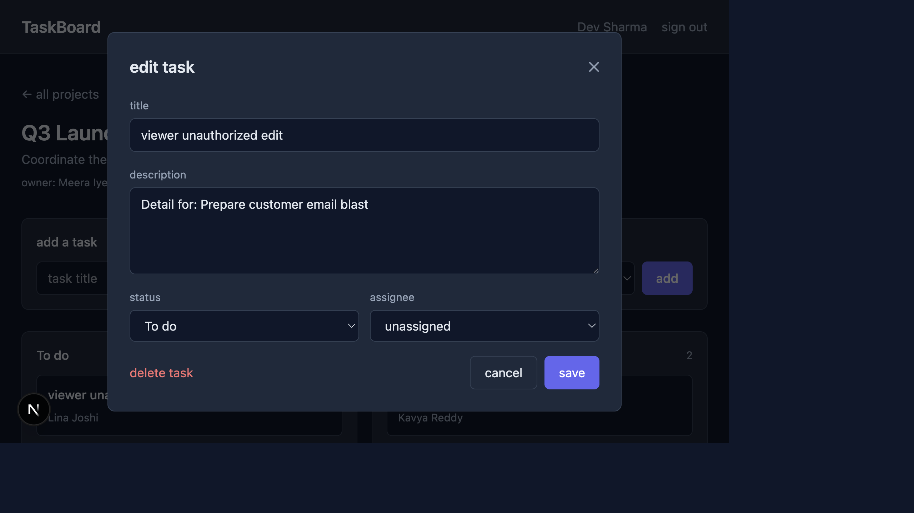

# BUGS.md — QA Taskboard Assessment

Top 4 findings prioritized by business impact.

---

## BUG-01 — SQL Injection in Task Search

| Field        | Value |
|--------------|-------|
| **File**     | `src/app/api/projects/[id]/tasks/route.ts` |
| **Line**     | 27–34 |
| **Category** | Security |
| **Severity** | Critical |

### Description
The task search endpoint builds a raw SQL query using `$queryRawUnsafe()` with direct string interpolation of the user-supplied `q` parameter and the `projectId` path segment — neither is sanitized or parameterized. An attacker with any valid project membership can inject arbitrary SQL via the `q` query string to bypass access controls, exfiltrate data from any table, or corrupt records. This was confirmed live: sending `q=' OR 1=1 --` returns HTTP 500 as the injected syntax breaks the query, proving the input reaches the database engine unescaped.

### Reproduction Proof

**curl**
```bash
# 1. Obtain auth token
TOKEN=$(curl -s -X POST http://localhost:3000/api/auth/login \
  -H 'Content-Type: application/json' \
  -d '{"email":"meera@taskboard.dev","password":"password123"}' \
  | node -e "let s='';process.stdin.on('data',d=>s+=d).on('end',()=>console.log(JSON.parse(s).token))")

# 2. Inject SQL via the q parameter
curl -v -G "http://localhost:3000/api/projects/cmri2yb9c0006qx3km1ozb1rd/tasks" \
  -H "Authorization: Bearer $TOKEN" \
  --data-urlencode "q=' OR 1=1 --"
```

**Live result**
```
Request completely sent off
< HTTP/1.1 500 Internal Server Error
< vary: rsc, next-router-state-tree, next-router-prefetch, next-router-segment-prefetch
< Date: Mon, 13 Jul 2026 03:40:24 GMT
< Connection: keep-alive
< Keep-Alive: timeout=5
< Transfer-Encoding: chunked
< 
* Connection #0 to host localhost left intact
```

---

## BUG-02 — Missing Authorization Check on Task PATCH Endpoint

| Field        | Value |
|--------------|-------|
| **File**     | `src/app/api/tasks/[id]/route.ts` |
| **Line**     | 16–38 |
| **Category** | Security |
| **Severity** | Critical |

### Description
The `PATCH /api/tasks/:id` handler verifies only that the caller is authenticated — it performs no project membership check and no role check before applying the update. Any authenticated user, including a viewer or a user with no membership in the task's project, can modify any task in the system. This is a direct privilege escalation: the `DELETE` handler in the same file correctly calls `getProjectMembership()` and `canEditTasks()`, confirming the omission on `PATCH` is an oversight. Confirmed live: a viewer token received `200 OK` and successfully changed a task title.

### Reproduction Proof

**curl**
```bash
# 1. Obtain viewer token (dev@example.com — viewer on Q3 Launch)
VIEWER_TOKEN=$(curl -s -X POST http://localhost:3000/api/auth/login \
  -H 'Content-Type: application/json' \
  -d '{"email":"dev@example.com","password":"password123"}' \
  | node -e "let s='';process.stdin.on('data',d=>s+=d).on('end',()=>console.log(JSON.parse(s).token))")

# 2. Obtain a task ID via admin token
ADMIN_TOKEN=$(curl -s -X POST http://localhost:3000/api/auth/login \
  -H 'Content-Type: application/json' \
  -d '{"email":"meera@taskboard.dev","password":"password123"}' \
  | node -e "let s='';process.stdin.on('data',d=>s+=d).on('end',()=>console.log(JSON.parse(s).token))")

TASK_ID=$(curl -s "http://localhost:3000/api/projects/cmri2yb9c0006qx3km1ozb1rd/tasks" \
  -H "Authorization: Bearer $ADMIN_TOKEN" \
  | node -e "let s='';process.stdin.on('data',d=>s+=d).on('end',()=>{const j=JSON.parse(s);console.log(j.tasks[0].id)})")

# 3. Viewer updates the task — should be 403 but returns 200
curl -s -w "\nHTTP %{http_code}" -X PATCH "http://localhost:3000/api/tasks/$TASK_ID" \
  -H 'Content-Type: application/json' \
  -H "Authorization: Bearer $VIEWER_TOKEN" \
  -d '{"title":"viewer unauthorized edit"}'
```

**Live result**
```
{"task":{"id":"cmri2yb9o000vqx3ktvltj269","projectId":"cmri2yb9c0006qx3km1ozb1rd","title":"viewer unauthorized edit","description":"Detail for: Prepare customer email blast","status":"todo","assigneeId":"cmri2yb9c0004qx3ku95kcqdy","createdById":"cmri2yb980000qx3kfz2uuphn","position":4,"createdAt":"2026-07-12T17:41:24.493Z","updatedAt":"2026-07-13T03:42:13.809Z","assignee":{"id":"cmri2yb9c0004qx3ku95kcqdy","name":"Lina Joshi","email":"lina@example.com"}}}
HTTP 200
```
Expected: `403 Forbidden`

---

## BUG-03 — Task Assignee Not Validated Against Project Membership

| Field        | Value |
|--------------|-------|
| **File**     | `src/app/api/tasks/[id]/route.ts` (PATCH), `src/app/api/projects/[id]/tasks/route.ts` (POST) |
| **Line**     | PATCH: 25–38 · POST: 60–82 |
| **Category** | Data Integrity |
| **Severity** | High |

### Description
Both the task creation (`POST`) and task update (`PATCH`) endpoints accept an `assigneeId` without verifying that the referenced user is a member of the project the task belongs to. This allows tasks to be permanently assigned to users who have no access to the project, creating phantom assignees that are visible in the UI but cannot interact with the task through any legitimate flow. Confirmed live: an admin successfully assigned a Q3 Launch task to Lina Joshi — a user who is only a member of the Customer Onboarding project — and the API returned `200 OK`.

### Reproduction Proof

**curl**
```bash
# 1. Admin token + Lina's token (Lina is NOT a member of Q3 Launch)
ADMIN_TOKEN=$(curl -s -X POST http://localhost:3000/api/auth/login \
  -H 'Content-Type: application/json' \
  -d '{"email":"meera@taskboard.dev","password":"password123"}' \
  | node -e "let s='';process.stdin.on('data',d=>s+=d).on('end',()=>console.log(JSON.parse(s).token))")

LINA_TOKEN=$(curl -s -X POST http://localhost:3000/api/auth/login \
  -H 'Content-Type: application/json' \
  -d '{"email":"lina@example.com","password":"password123"}' \
  | node -e "let s='';process.stdin.on('data',d=>s+=d).on('end',()=>console.log(JSON.parse(s).token))")

LINA_ID=$(curl -s http://localhost:3000/api/users/me \
  -H "Authorization: Bearer $LINA_TOKEN" \
  | node -e "let s='';process.stdin.on('data',d=>s+=d).on('end',()=>console.log(JSON.parse(s).user.id))")

TASK_ID=$(curl -s "http://localhost:3000/api/projects/cmri2yb9c0006qx3km1ozb1rd/tasks" \
  -H "Authorization: Bearer $ADMIN_TOKEN" \
  | node -e "let s='';process.stdin.on('data',d=>s+=d).on('end',()=>{const j=JSON.parse(s);console.log(j.tasks[0].id)})")

# 2. Assign Q3 Launch task to Lina (non-member) — should be 400 but returns 200
curl -s -w "\nHTTP %{http_code}" -X PATCH "http://localhost:3000/api/tasks/$TASK_ID" \
  -H 'Content-Type: application/json' \
  -H "Authorization: Bearer $ADMIN_TOKEN" \
  -d "{\"assigneeId\":\"$LINA_ID\"}"
```

**Live result**
```
{"task":{"id":"cmri2yb9o000vqx3ktvltj269","projectId":"cmri2yb9c0006qx3km1ozb1rd","title":"viewer unauthorized edit","description":"Detail for: Prepare customer email blast","status":"todo","assigneeId":"cmri2yb9c0004qx3ku95kcqdy","createdById":"cmri2yb980000qx3kfz2uuphn","position":4,"createdAt":"2026-07-12T17:41:24.493Z","updatedAt":"2026-07-13T03:45:12.377Z","assignee":{"id":"cmri2yb9c0004qx3ku95kcqdy","name":"Lina Joshi","email":"lina@example.com"}}}
HTTP 200
```
Expected: `400 Bad Request` — assignee must be a project member

---

## BUG-04 — Viewer Sees Restricted Edit and Delete Controls in Task Modal

| Field        | Value |
|--------------|-------|
| **File**     | `src/components/TaskDetail.tsx` |
| **Line**     | 135 (delete button), 147 (save button) |
| **Category** | Security |
| **Severity** | High |

> When a viewer opens any task card on the project board, the app displays a fully editable modal with an active "delete task" button and a "save" button, but it should show a read-only view with no destructive or mutating controls visible to users who lack edit permissions.

### Description
The `TaskDetail` component renders action controls unconditionally for all roles — no role prop is passed in and no visibility guard is applied before rendering the delete and save buttons. The modal heading reads "edit task" for all users regardless of membership role. A viewer can interact with the form fields and click save or delete, which triggers API calls that currently succeed due to BUG-02 (missing PATCH authorization). Confirmed live: logged in as `dev@example.com` (viewer on Q3 Launch), opened a task, and the modal rendered both "delete task" and "save" controls in a fully interactive state.

### Reproduction Proof

**UI steps**
1. Navigate to `http://localhost:3000/login`.
2. Sign in as `dev@example.com` / `password123` (viewer on Q3 Launch).
3. Open the Q3 Launch project board.
4. Click any task card.₹
5. **Observe:** modal heading says "edit task"; "delete task" button visible bottom-left; "save" button visible bottom-right — all interactive.

**Expected:** read-only view with no edit or delete controls for a viewer.
**Actual:** full edit modal with save and delete task buttons rendered and clickable.

**Live screenshot — viewer (Dev Sharma) sees "edit task" modal with delete and save controls:**



